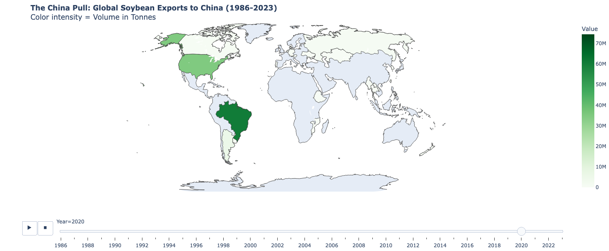
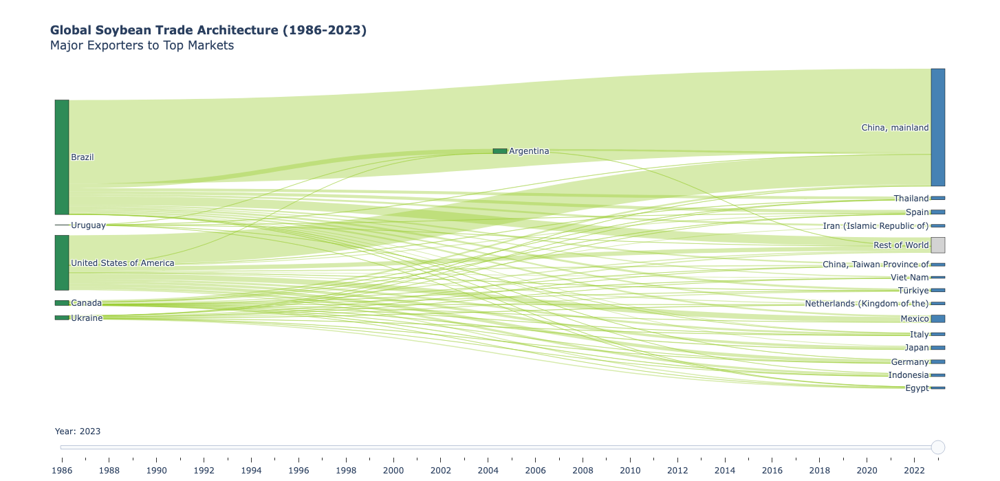

# Global Soybean Trade Analytics

A Python data analytics pipeline that visualizes the complex global trade flows of soybeans. 
This project transforms raw FAOSTAT trade data into interactive visualizations, highlighting the massive "pull" of China's market demand and the shifting architecture of global suppliers (US, Brazil, Argentina, etc.).

## Visualizations

### 1. The China Pull (Time-Lapse Map)
*An animated choropleth map tracking the volume of soybean exports to China from 1986 to 2023.*



> **Insight:** Visualizes how South American countries (especially Brazil) have emerged as dominant suppliers to China alongside the United States over the last three decades.

### 2. Global Trade Architecture (Interactive Sankey)
*A dynamic flow diagram showing the movement of soybeans from major exporters to their top trading partners.*



> **Insight:** Illustrates the "web" of global trade, allowing users to filter by year to see how trade relationships have diversified or consolidated over time.

---

## 📂 Project Structure

```text
├── src/
│   ├── data_loader.py       # Handles loading and cleaning of FAOSTAT CSVs
│   ├── data_processor.py    # Aggregates data for specific chart types
│   └── visualizer.py        # Contains Plotly logic for Maps and Sankey diagrams
├── FAOSTAT_data_...csv      # Raw datasets (Exports to China & Global Flows)
├── main.py                  # Entry point
├── requirements.txt         # Python dependencies
└── README.md                # Project documentation
